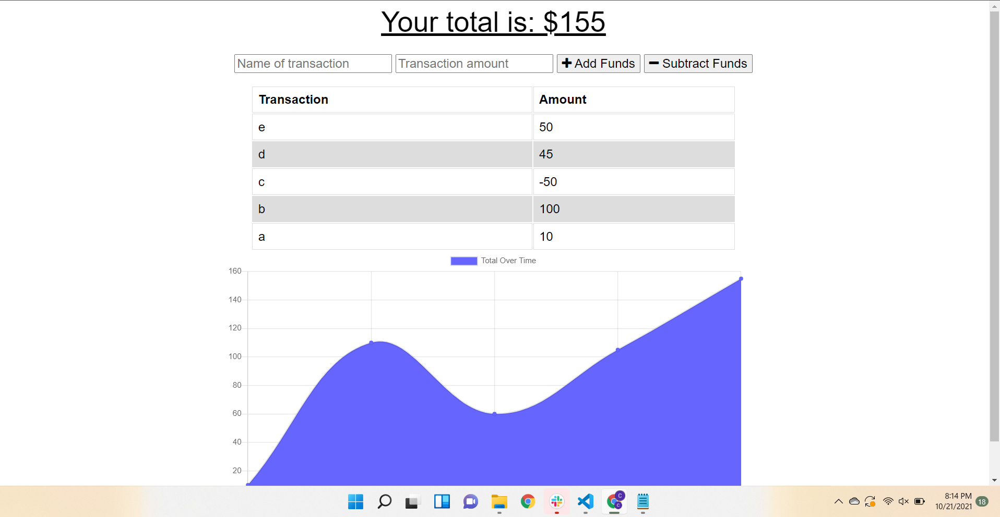

# Budget Tracker 
  
   
  ## Description
  🔍 An application made for avid travlers who want to calculate a budget both on and offline.
  ## Table of Contents
  - [Description](#description)
  - [Installation](#installation)
  - [Usage](#usage)
  - [License](#license)
  - [Contributing](#contributing)
  - [Tests](#tests)
  - [Questions](#questions)
  ## Installation
  💾 clone the project (prerequisite: node.js)  run npm init and install dependencies
  ## Usage
  💻 For online and offline budget tracking
  ## License
  
  
  This project was made without a/an  license.
  
  ## Contributing
  😇 PR's welcome
  ## Tests
  ❗  Add and subtract funds on the application and disable wifi and continue, reconnect to see your funds update
  ## Screenshot

  ## Application Link
  https://desolate-taiga-78574.herokuapp.com/
  ## Questions
  👽 email me! 
   
  :octocat: Find me on GitHub: [Cluce059](https://github.com/Cluce059) 
   
  💬 Email: Cluce059@gmail.com  
  _This README was generated with ❤️ by [README-generator](https://github.com/Cluce059/readme-generator) 	👀👀👀_